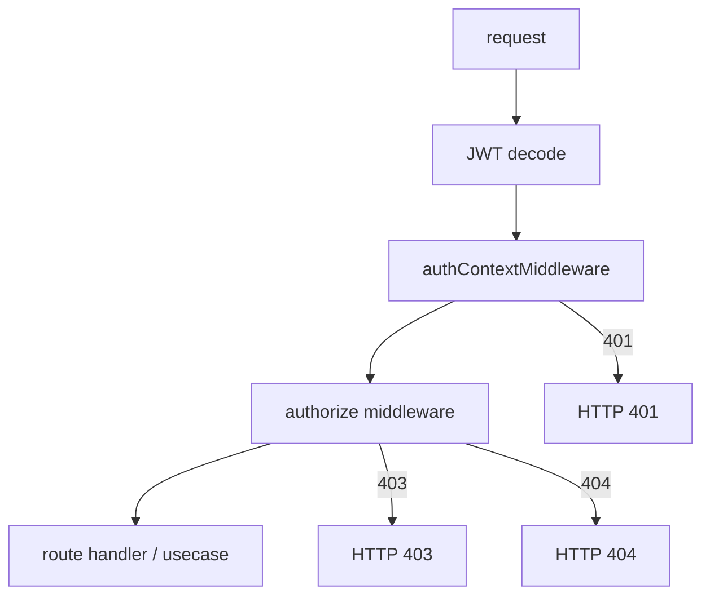
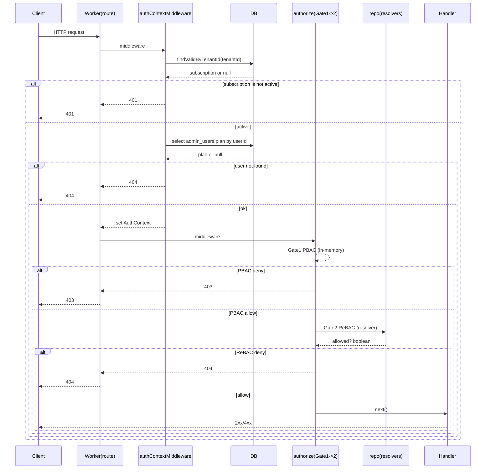

# 02. リクエストの認証・認可パイプライン

この章では、1 リクエストが「どの順番で」「どのデータに依存して」認証・認可されるかを固定します。

## パイプライン全体（Gate 1 → Gate 2）



## どこで何を作るか（AuthContext / PolicyContext）

- `AuthContext` は **認証ミドルウェア**で作ります。
  - 入力: `jwtPayload`（`sub`, `role`, `tenantId`）
  - 追加取得: DB から `plan`（`admin_users.plan`）
  - 出力: `AuthContext`（`userId`, `tenantId`, `role`, `plan`）
  - 実装: [`worker/middleware/auth.ts`](../../worker/middleware/auth.ts)

- `PolicyContext` は **authorize（Gate 1）内部**で組み立てます。
  - 入力: `AuthContext.role`, `AuthContext.plan`
  - 実装: [`worker/middleware/authorize.ts`](../../worker/middleware/authorize.ts), [`shared/permission/types.ts`](../../shared/permission/types.ts)

## 1リクエストの時系列（DB参照のタイミング）



ポイントは次の 2 つです。

- **PBAC は DB アクセスなしで評価する**（Gate 1 は `role + plan` のみ）。
- **ReBAC は repository 経由で評価する**（Gate 2 は resolver に DB アクセスを閉じ込める）。

## Gate 1 / Gate 2 の責務（実装に即した定義）

| Gate | 目的 | 入力 | 主な実装 | 否認時 |
|---|---|---|---|---|
| Gate 1: PBAC | 「その操作をしてよいか」 | `PolicyContext` | `POLICY_MAP` | 403 |
| Gate 2: ReBAC | 「そのリソースに辿り着ける関係があるか」 | `(repo, auth)` | `GateRelationResolver` / `useResolver` | 404 |

## ミドルウェアだけでポリシーを完結させない（状態に依存する制約）

「ポリシーの判定がユースケースまで降りてくるのが素直ではない。ミドルウェア層だけに閉じ込められないのか？」という疑問は自然です。ここで切り分けたいのは次の 2 つです。

- **Gate 1（PBAC）**: `role + plan` だけで決まる **許可操作・上限値の宣言**（インメモリで完結）
- **現在のリソース件数などと突き合わせる**制約: **テナントの実行時状態**が必要になる

後者を `authorize` だけで処理しようとすると、たとえば店舗作成の数量上限は次のように書けます（概念コード）。

```ts
// authorize ミドルウェア内でやろうとすると…
const currentCount = await repo.shop.countActiveByTenantId(auth.tenantId);
const { createShopLimit /* 例: ポリシーから取得 */ } = POLICY_MAP.settings[auth.role](
  /* PolicyContext */,
).listPermissions();
if (currentCount >= createShopLimit) throw 422; // 例
```

動作はしますが、設計上の負債になりやすいです。

- **ミドルウェアは「このリクエストを通すか」を決める層**であり、**「いま何店舗あるか」という業務状態への問い合わせ**をここに直接載せると、ミドルウェアが **ユースケース固有の知識**を抱え込む。
- ルートが増えるにつれ **`POST /shops` 専用の分岐**が `authorize` 周辺に増え、汎用のゲートから離れていく。
- テストでも **「ミドルウェアに shop リポジトリを渡して集計する」**といった依存になり、層の見通しが悪化する。

### Gate 2（ReBAC）との性質の違い

ReBAC がミドルウェア（Gate 2）に収まるのは、「**辺（関係）があるか**」という **到達可否の yes/no** に集中できるからです。一方、数量制限は「**いまいくつあるか**」という **実行時の集計と上限の比較**であり、性質が異なります。

| 観点 | Gate 2（ReBAC） | 数量制限チェック |
|---|---|---|
| 問い | 関係が存在するか | 現在の状態が上限内か |
| 答え | yes/no（関係という前提に対する判定） | 実行時の集計値に依存 |
| 責務の寄り | アクセス制御（到達可否） | 契約・プランに基づくビジネスルールの強制 |

したがって本プロジェクトでは、**PBAC で「できること・上限の宣言」まで**を Gate 1 に載せ、**実件数との突き合わせや拒否時のステータス**はハンドラ／ユースケース側で扱います（HTTP の分担は [`06-http-status-and-extension.md`](./06-http-status-and-extension.md)）。

- PBAC が宣言と強制をどう分けるか: [`03-pbac-policies.md`](./03-pbac-policies.md)
- ReBAC の境界（集計・上限の実効 enforcement は扱わない）: [`04-rebac-gates-and-resolvers.md`](./04-rebac-gates-and-resolvers.md)

次章から、それぞれの層（PBAC → ReBAC）を個別に分解します。

