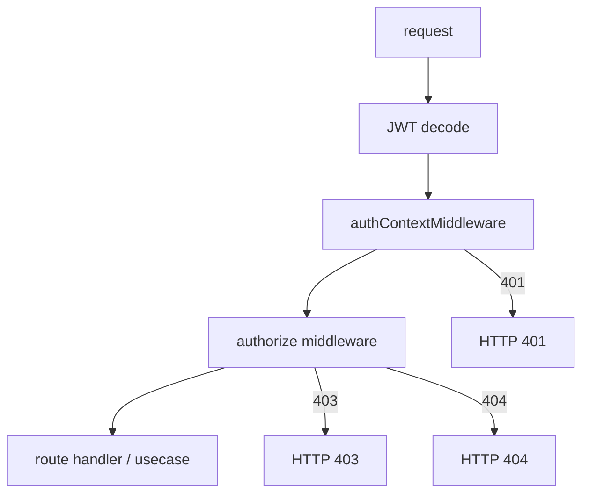
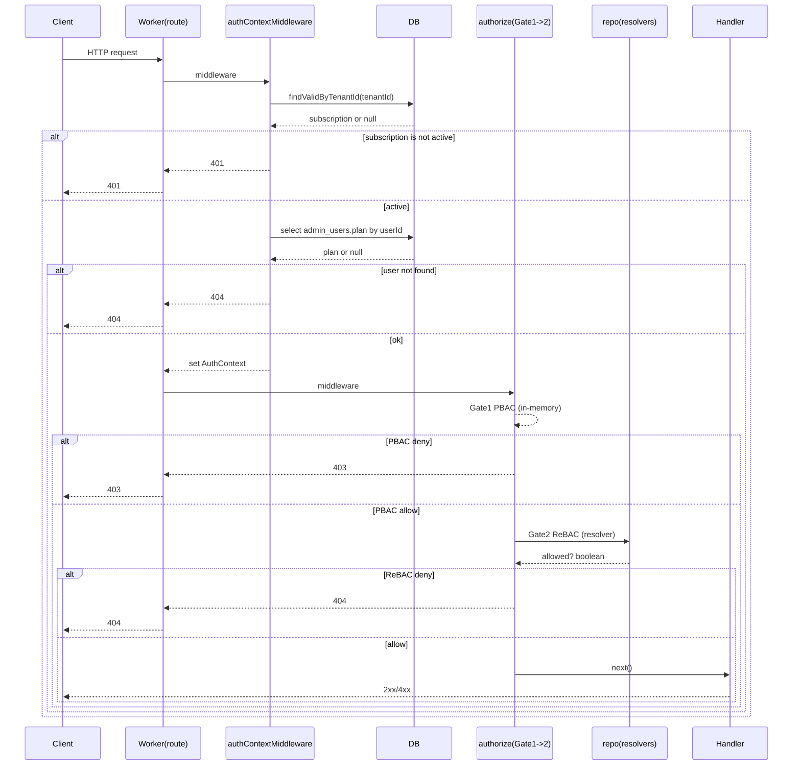

# 02. リクエストの認証・認可パイプライン

この章では、1 リクエストが「どの順番で」「どのデータに依存して」認証・認可されるかを固定します。

## パイプライン全体（Gate 1 → Gate 2）

## どこで何を作るか（AuthContext / PolicyContext）

- `AuthContext` は **認証ミドルウェア**で作ります。
  - 入力: `jwtPayload`（`sub`, `role`, `tenantId`）
  - 追加取得: DB から `plan`（`admin_users.plan`）
  - 出力: `AuthContext`（`userId`, `tenantId`, `role`, `plan`）
  - 実装: [`worker/middleware/auth.ts`](../../worker/middleware/auth.ts)

- `PolicyContext` は **authorize（Gate 1）内部**で組み立てます。
  - 入力: `AuthContext.role`, `AuthContext.plan`
  - 現状: `shop_ids` は未使用のため `[]`
  - 実装: [`worker/middleware/authorize.ts`](../../worker/middleware/authorize.ts), [`shared/permission/types.ts`](../../shared/permission/types.ts)

## 1リクエストの時系列（DB参照のタイミング）

ポイントは次の 2 つです。

- **PBAC は DB アクセスなしで評価する**（Gate 1 は `role + plan` のみ）。
- **ReBAC は repository 経由で評価する**（Gate 2 は resolver に DB アクセスを閉じ込める）。

## Gate 1 / Gate 2 の責務（実装に即した定義）

| Gate | 目的 | 入力 | 主な実装 | 否認時 |
|---|---|---|---|---|
| Gate 1: PBAC | 「その操作をしてよいか」 | `PolicyContext` | `POLICY_MAP` | 403 |
| Gate 2: ReBAC | 「そのリソースに辿り着ける関係があるか」 | `(repo, auth)` | `GateRelationResolver` / `useResolver` | 404 |

次章から、それぞれの層（PBAC → ReBAC）を個別に分解します。

