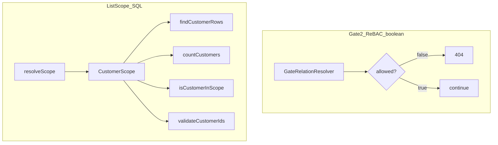
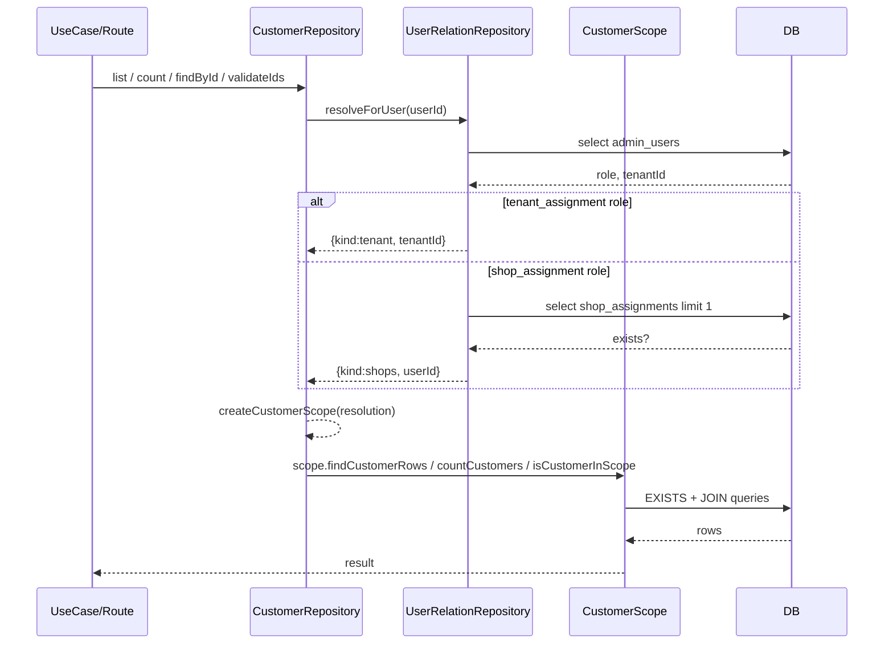

# 05. 一覧スコープ（CustomerScope）と Gate 2 の違い

初見で混同しやすいのが、次の 2 つです。

- `authorize` の **Gate 2（ReBAC）**: 「この 1 件のリソースに到達できるか」を boolean で判定する
- 一覧の **スコープ（CustomerScope）**: 「このユーザーが見える集合（SQL）」を作り、一覧・件数・ID 検証に使う

どちらも「関係性」に見えますが、責務と形が異なります。

## 役割の対比

## CustomerScope は Worker 層で実装される

`shared/permission/scope/customer/` は **interface と型だけ**を提供します。

- `CustomerScope` / `BaseCustomerScope`: [`shared/permission/scope/customer/scope.ts`](../../shared/permission/scope/customer/scope.ts)
- `ScopeMap`（型）: [`shared/permission/scope/customer/scope-map.ts`](../../shared/permission/scope/customer/scope-map.ts)

実際の SQL 実装は Worker 層にあり、`UserRelationRepository` によって「tenant スコープか shops スコープか」を解決して生成されます。

- 実装（SQL）: [`worker/repository/customer-scope.ts`](../../worker/repository/customer-scope.ts)
- 解決（ロール/割当）: [`worker/repository/user-relation.repository.ts`](../../worker/repository/user-relation.repository.ts)
- 利用（キャッシュして使い回す）: [`worker/repository/customer.repository.ts`](../../worker/repository/customer.repository.ts)

## スコープの流れ（一覧・単体・ID検証の共通基盤）

## なぜスコープは boolean ではなく SQL なのか

一覧は「候補が多い」ため、ReBAC のように「各 ID を 1 件ずつ boolean 判定」すると DB 往復や `IN (...)` が巨大になりがちです。

このため、スコープは次の方針で実装されています。

- **EXISTS + JOIN で DB 内で完結**させる
- `validateCustomerIds` では SQLite のパラメータ上限に配慮し、ID 配列をチャンクに分ける

実装例:

- `TenantCustomerScope`: `purchase_histories ⨝ shops` で `shops.tenantId` を条件にする
- `ShopsCustomerScope`: `purchase_histories ⨝ shop_assignments` で `userId` を条件にする

（詳細は [`worker/repository/customer-scope.ts`](../../worker/repository/customer-scope.ts) を参照）

