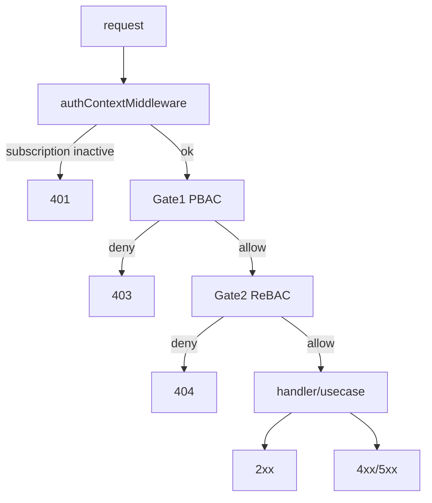

# 06. HTTP ステータスと拡張チェックリスト

この章では、PBAC / ReBAC を採用したことで「どの層がどのステータスを返すか」を短く固定し、エンドポイント追加時に迷わないためのチェックリストを置きます。

## ステータスの分担（このプロジェクトの方針）

- **401**: 認証コンテキストが作れない（例: subscription が無効）。
  - 実装: [`worker/middleware/auth.ts`](../../worker/middleware/auth.ts)
- **403**: PBAC（ポリシー）で操作が許可されない。
  - 実装: [`worker/middleware/authorize.ts`](../../worker/middleware/authorize.ts)
- **404**: ReBAC（関係性）で到達できない（＝存在を秘匿する）。
  - 実装: [`worker/middleware/authorize.ts`](../../worker/middleware/authorize.ts)

## 追加・変更のチェックリスト（新しいエンドポイント）

### 1) まず「この操作は PBAC か ReBAC か」を決める

- **PBAC**に置くもの:
  - 「操作ができるか」（CRUD、機能フラグ、プラン機能）
  - 「上限（数量制限）に達しているか」などの集計に近い判断は、PBAC ではなく **UseCase** 側に置く（入力や DB 集計に依存するため）
- **ReBAC**に置くもの:
  - 「そのリソースに辿り着ける関係があるか」（テナント一致、店舗割当、購入履歴経由など）

### 2) ルートパラメータは validate してから使う

`authorize` の resolver は URL パラメータに依存するため、**空文字や未検証の値**をそのまま Brand に渡さないようにします。

（例: `zValidator('param', ...)` を `authorize` より前に置く。詳細は ADR の「呼び出し側」節）

- ADR: [`specs/changes/20260505_add_rebac_pbac.md`](../changes/20260505_add_rebac_pbac.md)

### 3) authorize の呼び出し（典型形）

- PBAC のみ:
  - `authorize({ policy: { target, action } })`
- PBAC + ReBAC:
  - `authorize({ policy: { ... }, relation: { resolver: (c) => useResolver(key, args) } })`

### 4) 一覧の場合は Gate2 ではなく「スコープ」を検討する

一覧やエクスポートは「集合」を扱うため、Gate 2 の boolean 判定を繰り返すのではなく、`CustomerScope` のように SQL スコープとして表現します。

- 解説: [`specs/architecture/05-list-scopes.md`](./05-list-scopes.md)

