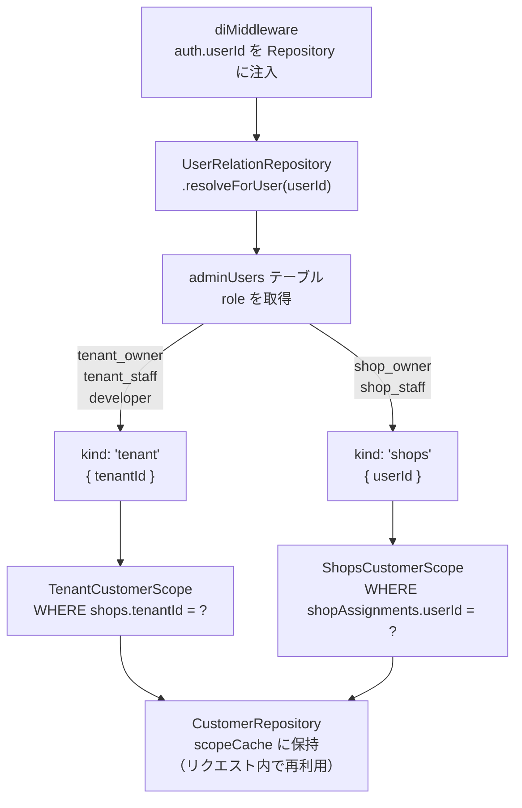

authからuserId（キー）を取得し、ScopeをRepositoryに注入しておく。そのRepositoryから`await this.resolveScope()`で呼び出すだけで、Scopeが解決済みのリポジトリが返るようにした。



```ts:worker/repository/customer.repository.ts
export class CustomerRepository {
  // 他のメソッドは省略
  async findPage(cursor, pageLimit) {
    const scope = await this.resolveScope() // スコープが適用済み
    const rows = (await scope.findCustomerRows(cursor, pageLimit + 1)) as CustomerRowWithDisplay[]
    const hasMore = rows.length > pageLimit
    const items = hasMore ? rows.slice(0, pageLimit) : rows
    const nextCursor = hasMore && items.length > 0 ? items[items.length - 1]?.id : null
    return { items, nextCursor }
  }
}
```

スコープを絞る処理が重厚長大なコードになっている。各リポジトリで実装が必要になっている
（今後の課題）

```ts:worker/repository/customer-scope.ts
class ShopsCustomerScope extends BaseCustomerScope {
  // 他のメソッドは省略
  // リレーションでスコープを絞る (該当店舗で購入履歴がある顧客のみとしている)
  async findCustomerRows(cursor: string | null, limit: number): Promise<CustomerRowWithDisplay[]> {
    const qb = this.db
      .select({ id: schema.purchaseHistories.customerId })
      .from(schema.purchaseHistories)
      .innerJoin(
        schema.shopAssignments,
        and(
          eq(schema.shopAssignments.shopId, schema.purchaseHistories.shopId),
          eq(schema.shopAssignments.userId, this.userId),
        ),
      )
    const idRows = await (cursor ? qb.where(gt(schema.purchaseHistories.customerId, cursor)) : qb)
      .groupBy(schema.purchaseHistories.customerId)
      .orderBy(asc(schema.purchaseHistories.customerId))
      .limit(limit)
      .all()
    const ids = idRows.map((r) => r.id)
    return fetchCustomersWithDisplayForIds(this.db, ids)
  }
}
```
